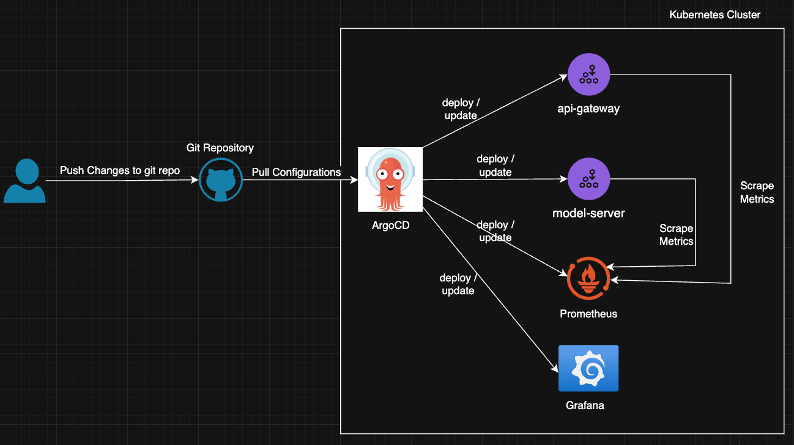

# ocr-model-test

# Architecture Diagram



# Directory Structure

<pre>repository-root/
├── Infrastructure/
    ├── docker/                 --> Includes dockerfiles and docker-compose files
    ├── gitops/
    │   └── apps/                   --> ArgoCD application configurations
    |   └── charts/                 --> Helm charts
    ├── monitoring/                 --> Monitoring Configurations
    └── scripts/                    --> Bash Scripts
    └── service-common-helm-chart   --> Common helm chart used to deploy api-gateway and model-server
 </pre>

# Containerisation Strategy

* Used an alpine based python base image with the least vulnerabilities to make the final image size smaller and enhance the security.
* Used a minimum RUN and COPY commands in the dockerfiles to reduce the layers in the final image.
* Python scripts which will be updated more frequently is copied after installing all the required packages, so the docker image cache will be used more often.

# Scripts

## Infrastructure/scripts/argocd-bootstrap.sh

This script is used to deploy argocd as a helm release, create argocd parent application and argocd project.
The argoCD parent application that gets deployed will deploy the child applications. (api-gateway, model-server, prometheus, grafana etc.) 

## Infrastructure/scripts/docker-build-test.sh

This script is used to build the docker images for both api-gateway, model-server and push the images to a private dockerhub repository.
This script expects the dockerhub repository name as the first argument.
Also this script deploys containers using docker-compose and runs a test which upload a test image to the application and check the response.

# Application Deployment

ArgoCD apps of apps deployment pattern is used to deploy the api-gateway, model-server and the infrastructure level services ( argocd, prometheus and grafana ). ArgoCD parent application configurations are in Infrastructure/gitops/apps path and Infrastructure/gitops/apps/templates directory includes the argocd child applications.

## Deployment Steps

1. Setup Minukube / Kind cluster in the local machine and connect to the cluster
2. Run Infrastructure/scripts/argocd-bootstrap.sh script, that will deploy argocd as a helm release, create argocd parent aplication and argocd  project
3. After some time all of the services ( grafana, prometheus, api-gateway and model-server ) will be deployed as argocd child applications
4. Access applications using port-forward
```
kubectl port-forward -n argo-cd  service/argo-cd-argocd-server 8083:80
kubectl port-forward -n api-gateway  service/api-gateway 8088:8080
kubectl port-forward -n monitoring  service/prometheus-grafana 8080:80
```

The docker images for api-gateway and model-server is built in an arm64 machine. If these fails to run in your machine, please follow these additional steps.

1. Fork https://github.com/Rusara-Jayawardane/ocr-model-test.git repository and create a new repository.
2. Update spec.source.repoURL and spec.source.targetRevision to match the new repository.
3. Run Infrastructure/scripts/argocd-bootstrap.sh script
4. Run Infrastructure/scripts/docker-build-test.sh to build, push and test docker images. 
    ```./Infrastructure/scripts/docker-build-test.sh  <custom-repository>```
5. Update the .Values.image.repository , .Values.image.tag in both Infrastructure/gitops/charts/api-gateway/values.yaml and Infrastructure/gitops/charts/model-server/values.yaml to use the latest docker image created in step 3
6. Commit the changes made in step 2 and 4 to the new repository
7. After sometime applications will be deployed.

# Application Monitoring

Prometheus is configured to collect metrices, logs and it is used as a data source in grafana.
Login to grafana and import the dashboard configurations in Infrastructure/monitoring/dashboards/ocr-model.json file.